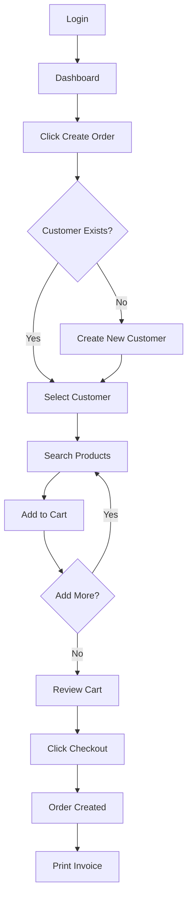

# Prompt for Gemini: UI/UX Design Documentation

## Context

Tôi đang làm dự án **Sales Management System** sử dụng ASP.NET Core MVC với Razor Views và Bootstrap 5. Hệ thống có 4 vai trò người dùng: Admin, Product Manager, Sales Staff, và Warehouse Manager.

## Request

Hãy giúp tôi tạo tài liệu **UI/UX Design** cho báo cáo dự án, bao gồm:

1. **Mockups for Key Screens**
   - Tạo wireframes/mockups cho các màn hình chính
   - Sử dụng mô tả text hoặc ASCII art (hoặc đề xuất tool tạo mockup)
   - Highlight các thành phần UI quan trọng

2. **Design Rationale**
   - Giải thích lý do thiết kế giao diện như vậy
   - Phân tích UX decisions (tại sao đặt button ở đây, tại sao dùng màu này...)
   - Accessibility và responsive design considerations

3. **User Flow Diagrams**
   - Sử dụng Mermaid.js để vẽ user flows
   - Mô tả các bước người dùng thực hiện để hoàn thành task

## Technical Details

- **Frontend**: Bootstrap 5 + Razor Views
- **Layout**: `_AdminLayout.cshtml` (sidebar navigation + top navbar)
- **UI Components**: Bootstrap cards, tables, forms, modals
- **Icons**: Bootstrap Icons
- **Theme**: Dashmin Admin Template (dark/light mode support)

## Key Screens cần Mockup:

### 1. Dashboard (Role-specific)
- **Admin Dashboard**: Doanh thu, biểu đồ, top products, top staff
- **Sales Staff Dashboard**: Đơn hàng cá nhân, doanh số bán ngày/tháng
- **Product Manager Dashboard**: Low stock alerts, sản phẩm bán chạy
- **Warehouse Manager Dashboard**: Phiếu nhập gần đây, tồn kho

### 2. Product Management (Product Manager)
- **Product List**: Table với search, filter, pagination
- **Product Create/Edit Form**: Upload ảnh, category dropdown, price, quantity

### 3. Order Management (Sales Staff) - POS Interface
- **Create Order Screen** (Quan trọng nhất):
  - Tìm kiếm khách hàng (hoặc tạo nhanh)
  - Tìm kiếm sản phẩm
  - Cart để chọn nhiều sản phẩm + số lượng
  - Tính tạm tính real-time
  - Nút "Thanh toán" để hoàn tất đơn
- **Order List**: Lọc theo trạng thái (Pending, Done, Cancelled)
- **Order Detail**: Hiển thị thông tin đơn + in hóa đơn

### 4. Import Order (Warehouse Manager)
- **Import Order Create**: Chọn Supplier, chọn Products, nhập giá vốn
- **Import Order List**: Table với thông tin tổng chi phí

### 5. User Management (Admin Only)
- **User List**: Table hiển thị Email, FullName, Role, Status
- **User Create/Edit**: Form với Role dropdown (4 roles)

### 6. Authentication
- **Login Page**: Email + Password + "Remember Me" checkbox
- **Profile Page**: Xem/sửa thông tin cá nhân, đổi mật khẩu

## User Flows cần mô tả:

### Flow 1: Sales Staff - Tạo đơn hàng mới
```
Start → Login → Dashboard → Click "Tạo đơn" → 
Tìm/Tạo khách hàng → Thêm sản phẩm vào giỏ → 
Điều chỉnh số lượng → Xem tạm tính → 
Click "Thanh toán" → Xác nhận → In hóa đơn → End
```

### Flow 2: Product Manager - Thêm sản phẩm mới
```
Start → Login → Dashboard → Navigate to Products → 
Click "Thêm sản phẩm" → Upload ảnh → 
Nhập thông tin (Name, Price, Category...) → 
Submit → Success → Redirect to Product List → End
```

### Flow 3: Warehouse Manager - Nhập kho
```
Start → Login → Dashboard → Navigate to Import Orders → 
Click "Tạo phiếu nhập" → Chọn Supplier → 
Thêm sản phẩm + giá vốn + số lượng → 
Xem tổng chi phí → Submit → 
Tự động cập nhật tồn kho → End
```

### Flow 4: Admin - Quản lý User
```
Start → Login → Dashboard → Navigate to Users → 
Click "Tạo User" → Nhập Email, Password, Role → 
Submit → Email gửi đến user mới → End
```

## Design Requirements

1. **Sidebar Navigation**:
   - Logo ở đầu
   - Menu items theo role (Admin thấy tất cả, Staff chỉ thấy Order/Customer)
   - Active state highlight
   - Collapsible sidebar (mobile)

2. **Top Navbar**:
   - Breadcrumb navigation
   - User profile dropdown (Logout, Profile)
   - Notification bell (optional)

3. **Tables**:
   - Striped rows
   - Hover effect
   - Action buttons (Edit, Delete) ở cột cuối
   - Pagination ở dưới

4. **Forms**:
   - Label rõ ràng
   - Validation messages màu đỏ
   - Required fields có dấu *
   - Submit button nổi bật (primary color)

5. **Color Scheme**:
   - Primary: Blue (#007bff) - cho Admin actions
   - Success: Green (#28a745) - cho successful operations
   - Warning: Orange (#ffc107) - cho pending/draft status
   - Danger: Red (#dc3545) - cho delete/cancel actions

## Output Format

Tạo file markdown với cấu trúc sau:

```markdown
# UI/UX Design Documentation

## 1. Design System

### Color Palette
[Mô tả màu sắc và ý nghĩa]

### Typography
[Font family, sizes, weights]

### Component Library
[Buttons, Cards, Forms, Tables...]

## 2. Key Screen Mockups

### 2.1. Dashboard - Sales Staff
[ASCII mockup hoặc mô tả chi tiết layout]

**Design Rationale:**
- Tại sao đặt biểu đồ doanh số ở đầu trang
- Tại sao hiển thị 5 đơn hàng gần nhất
[...]

### 2.2. Order Creation (POS)
[Mockup]

**Design Rationale:**
- Layout 2 cột: Sản phẩm bên trái, Giỏ hàng bên phải
- Tại sao dùng auto-complete search thay vì dropdown
[...]

### 2.3. Product List
[Mockup]

[...]

## 3. User Flow Diagrams

### 3.1. Sales Staff - Create Order Flow



**Step-by-step Description:**
1. User logs in as Sales Staff
2. [...]

### 3.2. Product Manager - Add Product Flow
[Mermaid diagram + description]

[...]

## 4. Responsive Design Strategy

### Desktop (>= 1200px)
- Sidebar luôn hiển thị
- Tables full-width

### Tablet (768px - 1199px)
- Sidebar collapsible
- Tables responsive scroll

### Mobile (< 768px)
- Sidebar hidden (hamburger menu)
- Cards thay vì tables

## 5. Accessibility Considerations

- Keyboard navigation support
- ARIA labels for screen readers
- Color contrast ratio >= 4.5:1
- Focus indicators rõ ràng

## 6. Interaction Patterns

### Loading States
- Spinners khi fetch data
- Skeleton screens cho tables

### Error Handling
- Toast notifications cho success/error messages
- Inline validation errors trong forms

### Confirmation Dialogs
- Modal confirm trước khi Delete
- Sweet Alert2 cho UX tốt hơn
```

## Notes

- Sử dụng tiếng Việt cho phần mô tả
- Mockups có thể dùng ASCII art hoặc mô tả chi tiết
- User flow diagrams sử dụng Mermaid.js
- Giải thích design decisions dựa trên UX principles
- Format chuyên nghiệp, phù hợp cho báo cáo học thuật
